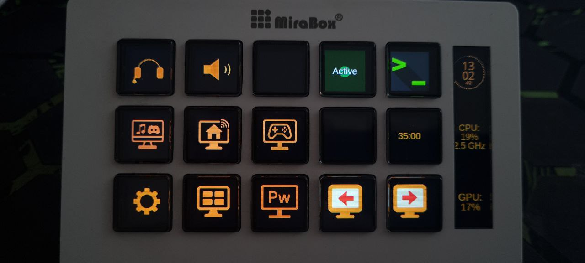
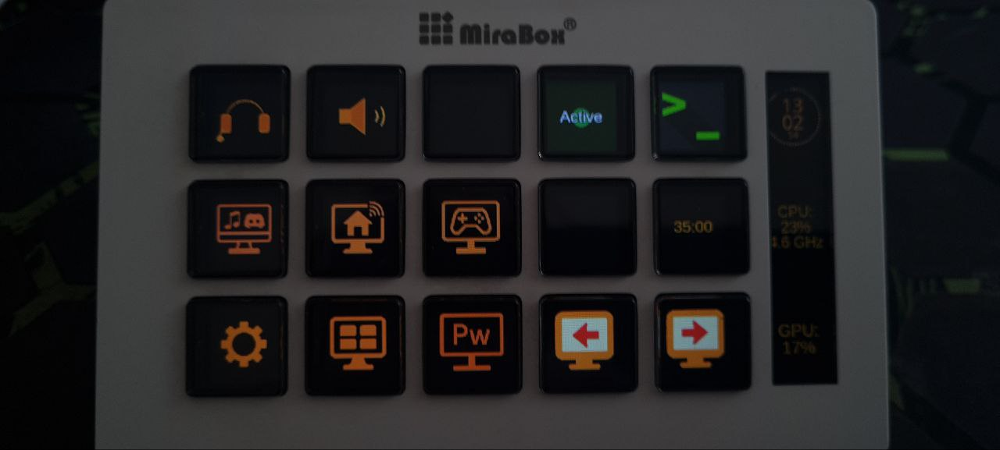
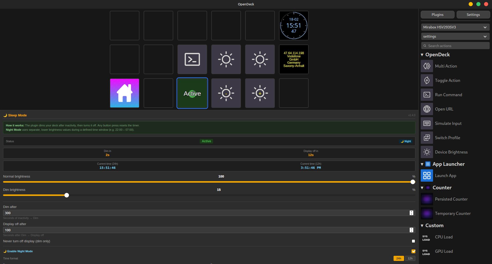
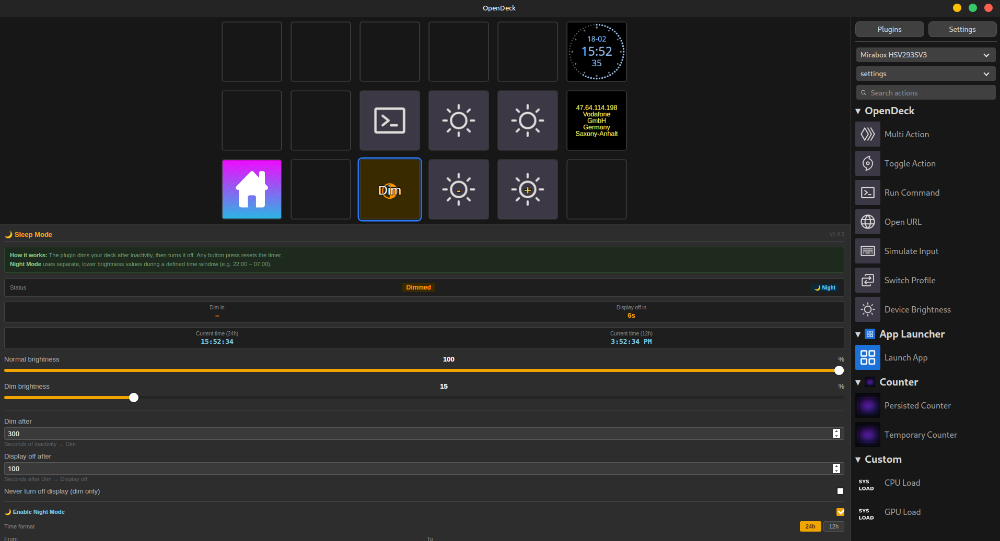
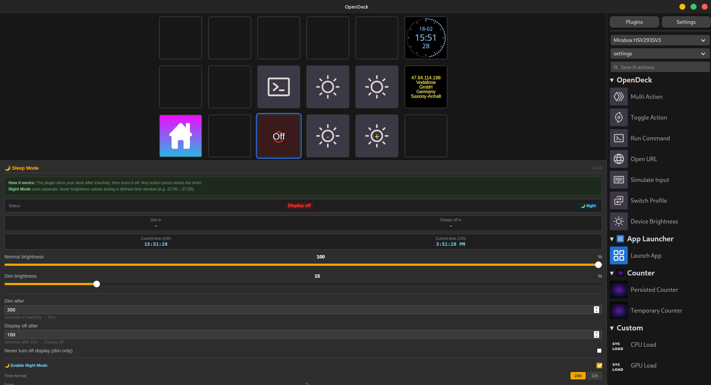

# 🌙 opendeck-mirabox-sleepmode
> **[English version below](#english)**
---
## Deutsch
Ein OpenDeck-Plugin für die **Mirabox HSV293S** (und kompatible AJazz/CRT-Protokoll-Geräte), das das Display nach Inaktivität automatisch dimmt und ausschaltet – mit echtem Hardware-Power-Off, nicht nur Helligkeits-Dimmen.
### Features
| | |
|---|---|
| 🔆 **Auto-Dim** | Display wird nach konfigurierbarer Inaktivitätszeit gedimmt |
| ⚫ **Echtes Display-Off** | Sendet den HID `HAN`-Befehl direkt ans Gerät – echter Hardware-Power-Off, kein PWM-Dimmen auf 0% |
| 👆 **Aufwecken per Tastendruck** | Jeder Tastendruck auf dem Deck weckt das Display sofort wieder auf |
| 🌙 **Nachtmodus** | Separate, niedrigere Helligkeitswerte und Timer für ein konfigurierbares Zeitfenster (z. B. 22:00–07:00) |
| 🕐 **Minutengenau** | Zeitfenster mit Stunden *und* Minuten einstellbar, wahlweise im 24h- oder 12h-Format |
| 🚫 **Nur-Dim-Modus** | Optional: Display wird nur gedimmt, nie ganz ausgeschaltet – separat für Tag und Nacht |
| 📊 **Live-Status** | Property Inspector zeigt aktuellen Status, Countdown bis Dim/Off und aktuelle Uhrzeit (24h + 12h) in Echtzeit |
| 🔘 **Button-Zustände** | Button zeigt den aktuellen Phase an: Aktiv / Gedimmt / Aus |

**Beispiele für Dimming (echte Bilder):**

<p align="center">
  
  
  
</p>

### Voraussetzungen
- **Betriebssystem:** Linux
- **Gerät:** Mirabox HSV293S (oder anderes AJazz-Gerät mit CRT-HID-Protokoll)
- **Software:** [OpenDeck](https://github.com/nekename/OpenDeck)
- **Berechtigungen:** Keine zusätzliche Konfiguration nötig – wenn OpenDeck bereits läuft und den Deck ansteuert, hat der Nutzer automatisch den benötigten HID-Zugriff
### Installation
1. **Datei herunterladen:**
   [`com.rainer.sleepmode.streamDeckPlugin`](https://github.com/heiko1988/opendeck-sleepmode/releases/latest/download/com.rainer.sleepmode.streamDeckPlugin)
2. **In OpenDeck installieren:**
   OpenDeck öffnen → **Einstellungen → Plugins → Plugin installieren** → Datei auswählen
3. **Plugin auf den Button ziehen** und konfigurieren
### Bedienung
| Aktion | Ergebnis |
|---|---|
| Display ist gedimmt oder aus → **Taste drücken** | Display wacht sofort auf, Timer wird zurückgesetzt |
| Display ist aktiv → **Taste drücken** | Sleep Mode wird deaktiviert (Button zeigt „Inactive") |
| Sleep Mode ist inaktiv → **Taste drücken** | Sleep Mode wird wieder aktiviert |
### Einstellungen (Property Inspector)
**Tag-Einstellungen:**
- **Normal brightness** – Helligkeit wenn aktiv (10–100 %)
- **Dim brightness** – Helligkeit im gedimmten Zustand (0–100 %)
- **Dim after** – Sekunden Inaktivität bis zum Dimmen
- **Display off after** – Sekunden nach dem Dimmen bis zum echten Ausschalten
- **Never turn off display** – Nur dimmen, nie ganz ausschalten

**Nacht-Modus:**
- **Enable Night Mode** – Nachtmodus aktivieren
- **From / To** – Zeitfenster (mit Minuten, 24h oder 12h Format)
- **Night brightness / Night dim brightness** – Eigene Helligkeitswerte für die Nacht
- **Night dim after / Night display off after** – Eigene Timer für die Nacht
- **Never turn off at night** – Nur dimmen, unabhängig von der Tag-Einstellung

**Beispiele für Settings-Anzeigen:**

<p align="center">
  
  
  
</p>

---
## English
A plugin for OpenDeck for the **Mirabox HSV293S** (and compatible AJazz/CRT-protocol devices) that automatically dims and powers off the display after inactivity – with true hardware power-off, not just brightness dimming.
### Features
| | |
|---|---|
| 🔆 **Auto-Dim** | Display dims after a configurable inactivity timeout |
| ⚫ **True Display Off** | Sends the HID `HAN` command directly to the device – real hardware power-off, not PWM dimming to 0% |
| 👆 **Wake on button press** | Any button press on the deck instantly wakes the display |
| 🌙 **Night Mode** | Separate, lower brightness values and timers for a configurable time window (e.g. 22:00–07:00) |
| 🕐 **Minute precision** | Time window configurable with hours *and* minutes, in 24h or 12h format |
| 🚫 **Dim-only mode** | Optional: display only dims, never fully powers off – configurable independently for day and night |
| 📊 **Live status** | Property Inspector shows current status, countdown to Dim/Off and current time (24h + 12h) in real time |
| 🔘 **Button states** | Button reflects current phase: Active / Dimmed / Off |

**Examples for Dimming (real photos):**

<p align="center">
  
  
  
</p>

### Requirements
- **OS:** Linux
- **Device:** Mirabox HSV293S (or other AJazz device using the CRT HID protocol)
- **Software:** [OpenDeck](https://github.com/nekename/OpenDeck)
- **Permissions:** No additional configuration needed – if OpenDeck is already running and controlling the device, the user automatically has the required HID access
### Installation
1. **Download the plugin file:**
   [`com.rainer.sleepmode.streamDeckPlugin`](https://github.com/heiko1988/opendeck-sleepmode/releases/latest/download/com.rainer.sleepmode.streamDeckPlugin)
2. **Install in OpenDeck:**
   Open OpenDeck → **Settings → Plugins → Install Plugin** → select the downloaded file
3. **Drag the action onto a button** and configure it
### Usage
| Action | Result |
|---|---|
| Display is dimmed or off → **press button** | Display wakes up immediately, timer resets |
| Display is active → **press button** | Sleep Mode is disabled (button shows "Inactive") |
| Sleep Mode is inactive → **press button** | Sleep Mode is re-enabled |
### Settings (Property Inspector)
**Day settings:**
- **Normal brightness** – brightness when active (10–100 %)
- **Dim brightness** – brightness when dimmed (0–100 %)
- **Dim after** – seconds of inactivity before dimming
- **Display off after** – seconds after dimming before true power-off
- **Never turn off display** – dim only, never fully power off

**Night Mode:**
- **Enable Night Mode** – activate night mode
- **From / To** – time window (with minutes, 24h or 12h format)
- **Night brightness / Night dim brightness** – separate brightness values for night
- **Night dim after / Night display off after** – separate timers for night
- **Never turn off at night** – dim only at night, independent of the day setting

**Examples for Settings Displays:**

<p align="center">
  
  
  
</p>

### How it works (technical)
The plugin communicates with OpenDeck via WebSocket for brightness control and button state updates. For the true display power-off it bypasses OpenDeck and writes the `HAN` command (`CRT\x00\x00HAN`, 513 bytes) directly to the HID raw device (`/dev/hidraw8` or `/dev/hidraw9`). Waking is done by sending a brightness value via the normal WebSocket path, which issues a `LIG` command to the device.
The plugin also monitors the HID device for input reports (button presses) to reset the inactivity timer – this means pressing *any* button on the deck, not just the Sleep Mode button, resets the countdown.
### Build from source
```bash
git clone https://github.com/heiko1988/opendeck-sleepmode.git
cd opendeck-sleepmode
cargo build --release
